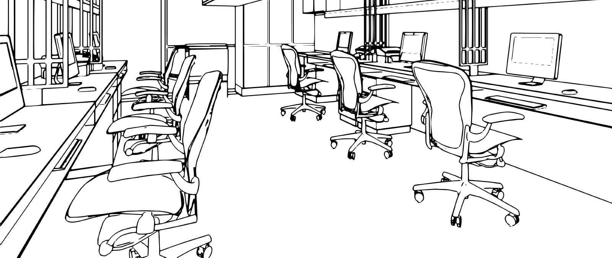

# Infrastructure Build for NPO's New Department
Deployed and configured essential equipment to establish a productive workspace environment. This included setting up workstations, monitors, ethernet cabling, network equipment, desktop printers, copy machines, postage machines, and laptops.

## Environments and Technologies Used

- Dell Optiplex 7080 Workstations
- Microsoft Office Professional Plus 2019
- Bitdefender GravityZone
- Google Workspace Sync
- Active Directory

## Operating Systems Used

- Windows 10

## High-Level Deployment and Configuration Steps

- Conduct a site survey to assess the workspace layout and requirements
- Procured necessary hardware equipment based on the survey findings
- Install ethernet cabling, patch panel, and managed switch
- Set up monitors, desktop printers, copy machines, and postage machines in designated areas
- Installed and configured workstations and laptops
    - Joined machines to the AD domain
    - Installed Microsoft Office 2019
    - Installed and configured Google Workspaces Sync
    - Installed Bitdefender GravityZone client software
- Provide training sessions for employees to familiarize them with the new equipment

<h2>Architecture Diagram</h2>

